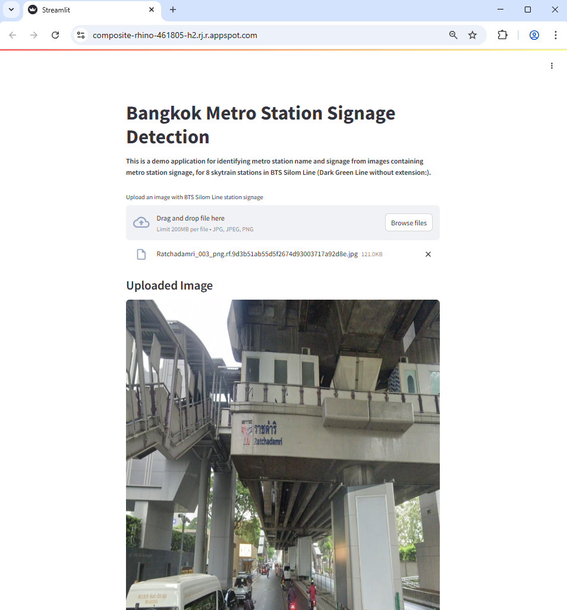
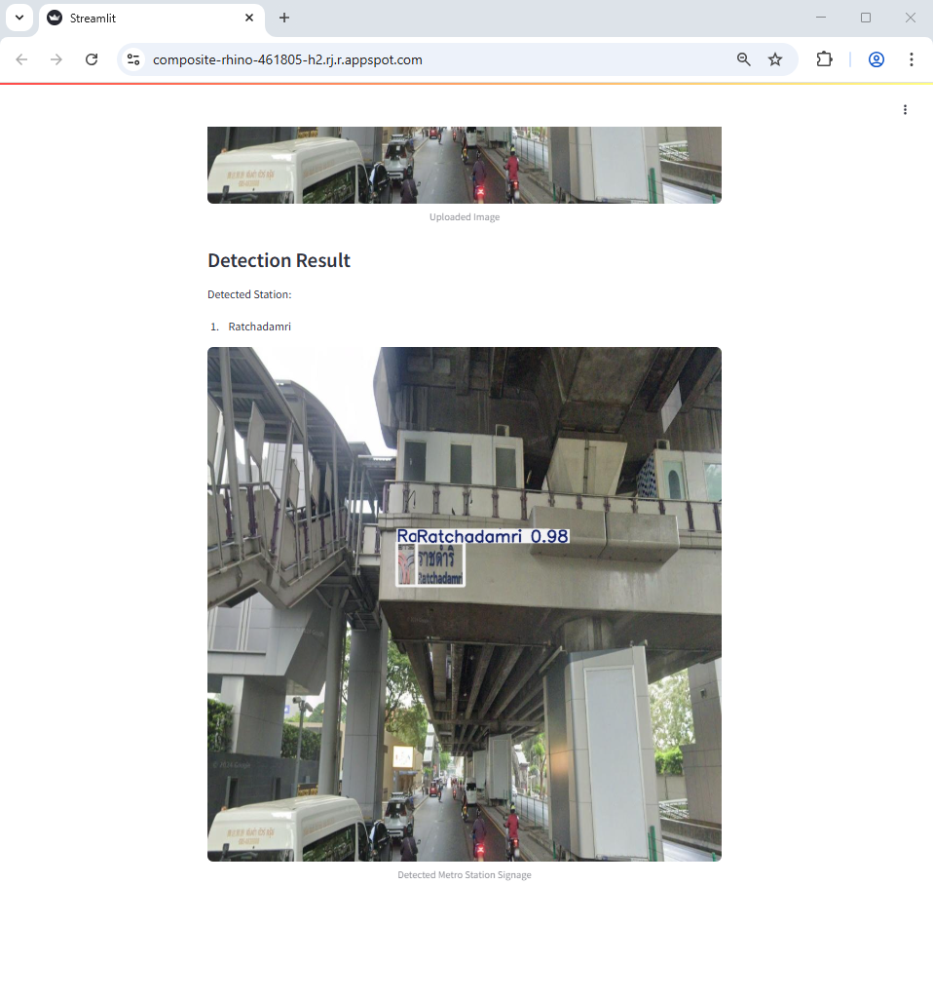

# AIPI 540: Computer Vision Module Project: Bangkok Metro Station Signage Detection
### **Author**: Matana Pornluanprasert

This project allows users to detect metro station name from an image containing metro station signage, with the use of deep learning (YOLOv8 transfer learning), and evaluate model performance in comparison with classical machine learning (support vector classifier) and naive models. It was trained with images containing signages of 8 skytrain stations in BTS Silom Line (Dark Green Line without extension) in Bangkok, Thailand, and it can classify station name out of the list of these eight stations, as well as drawing a bounding box around the detected station signage.<br>
<br>

***
# The Problem<br>
In a big city like Bangkok, metro/skytrain is the main mass transit system that allows tourists to visit attractions easily and affordably. However, this is under the assumption that tourists can read English or Thai language, as all signages are writen in these two languages. Chinese, Japanese, and Korean, for example, may not be able to read the signage or type in the station name in search engine on their mobiles to search for relevant information.<br>

This project aims to enable foreign tourists to be able to recognize metro station name from station signages of BTS Silom Line skytrain (Dark Green Line without extension) in Bangkok, Thailand. The possible enhancement to this project is to translate the station name to native languages that tourists can read and pronounce.<br>


***
# Data Source<br>
The training data comprises of images containing metro station signages of 8 stations in BTS Silom Line (Dark Green Line without extension), which includes National_Stadium, Siam, Ratchadamri, Sala Daeng, Chong Nonsi, Saint Louis, Surasak, and Saphan Taksin. This is one of the most popular metro line for tourists in Bangkok. The data was gathered from the internet via Google Map and Google Streetview.<br>


***
# Model Evaluation Process & Metric Selection<br>
As our classes are quite balanced, we use test accuracy as the model evaluation for the station classification problem. Although YOLOv8 can do object detection with bounding box, our focus is to provide a tool for tourists to identify station name. It does not matter if the bounding box fit well with the station signage or not. We provide bounding box here just in case that there are multiple signages from two nearby/interchange stations, and tourists can distinguish these two stations by looking at the bounding boxes with station names on top.<br>


***
# Modeling Approach<br>

**Data Processing Pipeline**<br>
The raw data are processed with the following steps:<br>
1. Raw data, images gathered from Google Map and Google Streetview, are collected and stored in data/raw folder, with subfolder for each station images (average of approx 100 photos per station)
2. Remove corrupted images, duplicates, and rename images, then save them in the data/processed_before_roboflow folder (Folder excluded from the repo to save space)
3. Upload the dataset to Roboflow, annotate the images, draw bounding boxes manually, and then export the dataset in YOLO format.
4. Split the dataset into training, validation, and test sets, then save them in the data/outputs folder. This set will be used for YOLOv8
5. Crop the images with ground truth bounding boxes, in the training, validation, and test sets to create a new dataset with only the metro station signages. This is for the SVC model.
6. Build HOG features and labels for the SVC model
7. Split the dataset from 5. for SVC model training (hyperparameter tuning) and evaluation<br>

**Model evaluated and model selected**<br>
We evaluate the model by comparing test accuracy of two models<br>
1. Deep-learning model: YOLOv8 transfer learning
2. Classical machine learning model: Support Vector Classifier (SVC)<br>

YOLOv8 is choosen as the top choice for deep learning model, thanks to its SOTA objection detection with bounding boxes. SVC + HOG is used to represent classical machine learning model. The two models are trained on the dataset of images containing station signages. <br>

The training and test set used to train and evaluate the two models are, however, not exactly the same. For SVC, we use cropped station signage images, while for YOLOv8, we use typical images containing station signages, and the signages may have complex scenes as background. With dataset for YOLOv8, we cropped them with ground truth bounding boxes and use these cropped images as a dataset for SVC. Without cropped signage images, SVC may not be able to classify station name by using HOG features at all, due to complex scenes normally presented in typical photos taken by tourists.<br>

The dataset is splitted into train, validation, and test set, at a ratio of 80%, 10%, 10%.<br>

**Comparison to naive approach**<br>
As a baseline comparison, we introduce two naive models:
1. Naive model option 1: Always predicts 'Siam', which has the highest ridership, according to the statistics from BTS, the metro operator.
2. Naive model option 2: Randomly predicts one of the 8 stations, based on the frequency of the stations in the training set.<br>


***
# Demo of project's visual interface<br>
Demo application is deployed on Google Cloud, and can be accessed via the link below:<br>
https://composite-rhino-461805-h2.rj.r.appspot.com/

Upload an image (jpg) containing station signage:<br>


The app will return resulting image with bounding box(es) on signage and display the name of detected station:<br>



***
# Results and Conclusions<br>
YOLOv8 model achieves the best overall test classification accuracy, at 0.731884, while SVC + HOG model gets 0.625899. It seems that SVC can get test accuracy not so far from YOLOv8, however, we assist the SVC model by giving it test samples of cropped signage images, unlike the full images with complex scenes background that we use to test YOLOv8. In the real world usage, no one would want to take a picture and crop it before submitting to the app to identify a station, as it is not practical.<br>

We choose YOLOv8 for our demo app with Streamlit interface over SVC for four reasons: <br>
1. higher accuracy
2. no need to crop images, and can handle complex scenes
3. inference time taken is significantly lower than SVC
4. bounding boxes around station signage, which may be useful in case where user wants to distinguish two nearby/interchange stations<br>

Compared to the two naive models, YOLOv8 and SVC are far superior in terms of test classification accuracy, as the accuracy of naive models are only around 0.1<br>


***
# Ethics statement<br>
This project is intended for research and educational purposes in computer vision and deep learning. All data collection, model training, and deployment are conducted with respect for privacy and copyright. Care has been taken to avoid misuse of the model and to ensure responsible use of the technology, particularly in relation to surveilance, personal data, and public safety.<br>


***
# Requirements and How to run the code

### **Requirements**:<br>
```
numpy==1.26.4
ultralytics==8.3.150
scikit-learn==1.0.2
scikit-image==0.25.2
opencv-python-headless==4.11.0.86
Pillow==11.2.1
joblib==1.5.1
streamlit==1.45.1
PyYAML==6.0.2
imgaug==0.4.0
matplotlib==3.8.4
```
<br>

### **How to run the code**:<br>
***
Inference Mode: To run the inference mode with Streamlit visual interface code, type the followings in the terminal<br>

```
streamlit run main.py
```

Then go to http://localhost:8080 with your browser. Upload an image (jpg) containing station signage and then the code will return resulting image with bounding box(es) on signage and display the name of detected station.

Training Mode: type the followings in the terminal<br>

On Windows:<br>

```
py setup.py
```

On other systems:<br>

```
python py setup.py
```

<br>
<br>


***
